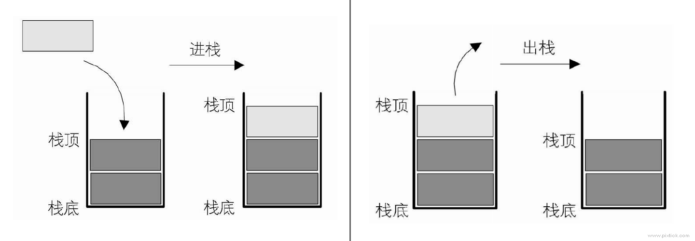
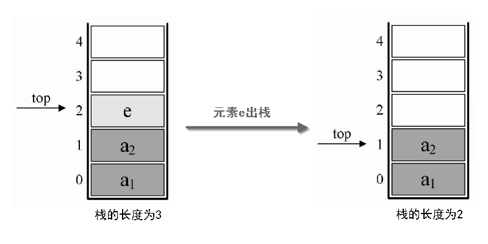
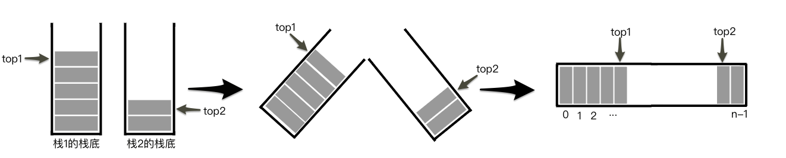

# High!栈与队列

## 认识什么是栈

__栈(stack)：__是限定仅在表尾进行插入和删除操作的线性表。又称为后进先出(Last in First out)的线性表，简称LIFO结构。

__栈顶(top)：__允许插入和删除操作的一端。

__栈底(bottom)：__当然是栈顶的另一端 :D

__空栈：__不含任何数据元素的栈。

__栈的插入操作：__叫做进栈，也成压栈，入栈。

__栈的删除操作：__叫做出栈，也有叫做弹栈。



---

首先要知道栈其实是一个线性表，那么，栈元素具有线性关系，即前驱后继关系，只不过它是一个特殊的线性表而已。栈这个线性表的表尾进行插入和删除操作，__这里表尾是指栈顶，而不是栈底。__

它的特殊之处就在于限制了这个线性表的插入和删除位置，它始终只在栈顶进行。栈底是固定的，最先进栈的只能在栈底。

> 思考：最先进栈的元素，是不是只能是最后出战呢？ 

这是不一定的。栈对线性表的插入和删除的位置进行了限制，并没有对元素进出的时间进行限制。也就是说，，在不是所有元素都进栈的情况下，事先进去的元素也可以出栈，只要保证是栈顶元素出栈就可以。

举例来说，如果现在是有3个整型数字元素1、2、3依次进栈，可以有这些出栈次序：

* 第一种：1、2、3进，再3、2、1出。出栈次序为321。
* 第二种：1进，1出，2进，2出，3进，3出。出栈次序为123。
* 第三种：1进，2进，2出，1出，3进，3出。出栈次序为213。
* 第四种：1进，1出，2进，3进，3出，2出。出栈次序为132。
* 第五种：1进，2进，2出，3进，3出，1出。出栈次序为231。

__注意：__这里不可能发生312这样的次序出栈，因为3先出栈，就意味着，3曾经进栈，既然3都进栈了，那也就意味着，1和2已经进栈了，此时，2一定是在1的上面，就是更接近栈顶，那么出栈只可能是321，不然不满足123依次进栈的要求，所以此时不会发生1比2先出栈的况。

从这个简单的例子就能看出，只是3个元素，就有5种可能的出栈次序，如果元素数量多，其实出栈的变化将会更多的。这个知识点一定要弄明白。

<br>

## 栈的抽象数据类型

```
ADT 栈(stack)
Data
     同线性表。元素具有相同的类型，相邻元素具有前驱和后继关系。
Operation
     InitStack(*S):     初始化操作，建立一个空栈S。
     DestroyStack(*S):  若栈存在，则销毁它。
     ClearStack(*S):    将栈清空。
     StackEmpty(S):     若栈为空，返回true，否则返回false。
     GetTop(S, *e):     若栈存在且非空，用e返回S的栈顶元素。
     Push(*S, e):       若栈S存在，插入新元素e到栈S中并成为栈顶元素。
     Pop(*S, *e):       删除栈S中栈顶元素，并用e返回其值。
     StackLength(S)；   返回栈S的元素个数。
```

<br>

## 栈的顺序存储结构及实现

### 栈的顺序存储结构

栈的顺序存储结构定义代码：

```c
/* SElemType类型根据实际情况而定，这里假设为int */
typedef int SElemType;
typedef struct 
{
    SElemType data[MAXSIZE];
    int top; /* 用于栈顶指针，指示栈顶元素在数组中的位置，想象这top就如同中学物理学过的游标卡尺的游标 */
             /* 当栈存在一个元素时，top等于0，因此通常把空栈的判定条件定为top等于-1。 */
} SqStack;
```

用一个StackSize为5的栈，图示栈普通情况、空栈和栈满的情况示意图：


### 栈的顺序存储结构——进栈

栈的插入，使用push()函数实现进栈操作，原理图：


实现代码：

```c
/* 插入元素e为新的栈顶元素 */
Status Push(SqStack *S, SElemType e)
{
    /* 如果发生栈已经满了的情况，则会栈溢出 */
    if( S->top == MAXSIZE - 1 )
        return ERROR;
    S->top++; /* 栈顶指针增加1个单位 */
    S->data[S->top] = e;
    return OK;
}
```

### 栈的顺序存储结构——出栈

栈元素的删除，使用pop()函数实现出栈操作，原理图：



实现代码：

```c
/* 若栈不空，则删除S的栈顶元素，用e返回其值，并返回OK，否则返回ERROR */
Status pop(SqStack *S, SElemType *e)
{
    if(S->top == -1)
        return ERROR;
    *e = S->data[S->top]; /* 将要删除的栈顶元素赋值给e */
    S->top--;
    return OK;
}
```


---

__出栈操作与进栈操作两者没有涉及到任何循环语句，因此时间复杂度均是O(1)。__

---

<br>

## 两栈共享空间

其实栈的顺序存储还是很方便的，因为它只准栈顶进出元素，所以不存在线性表插入和删除时需要移动元素的问题。不过它有一个很大的缺陷，就是必须事先确定数组存储空间大小，万一不够用了，就悲剧了，需要编程手段来扩展数组的容量，非常麻烦。

对于两个相同类型的栈，这个好办法充分利用了单个数组来存储——两栈共享空间。数组有两个端点，两个栈有两个栈底，让一个栈的栈底为数组的始端，即下标为0处，另一个栈底为数组的末端，即下标为数组长度n-1处。这样，两个栈如果增加元素，就是两端点向中间延伸。

图示：



__关键思路：__ 它们是在数组的两端，向中间靠拢。top1和top2是栈1和栈2的栈顶指针，可以想象，只要它们俩不见面，两个栈就可以一直使用。

__极端情况：__

 * 两个栈见面之时，也就是两个指针之间相差1时，即top + 1 == top2为栈满。 
 * 栈1为空时，top1等于-1；
 * 栈2为空时，top2等于n；
 * 若栈2是空栈，栈1的top1等于n-1时，就是栈1满了；
 * 若栈1是空栈，栈2的top2等于0时。就是栈2满了；

使用这样的数据结构，通常都是当两个栈的空间需求有相反关系时，也就是一个栈增长时另一个栈在缩短的情况。就像QQ游戏打台球，一个人输掉金币，肯定另一个人赚取金币。这样使用两栈共享空间存储方法才有比较大的意义。否则两个栈都在不停地增长，那很快就会因栈满而溢出了。

### 两栈共享空间结构的存储结构

两栈共享空间的存储结构代码：

```c
/* 两栈共享空间结构 */
typedef struct
{
    SElemType data[MAXSIZE];
    int top1; /* 栈1栈顶指针 */
    int top2; /* 栈2栈顶指针 */
} SqDoubleStack;
```

### 两栈共享空间结构——进栈

对于两栈共享空间结构的push方法，除了要插入元素值参数外，还需要有一个判断是栈1还是栈2的栈号参数stackNumber。

插入元素(进栈操作)的代码如下：

```c
/* 插入元素e为新的栈顶元素 */
Status push(SqDoubleStack *S, SElemType e, int stackNumber)
{
    if(top1 + 1 == top2) /* 栈已满，不能再push新元素了 */
        return ERROR;
    if(stackNumber == 1)
        S->data[++S->top1]; /* 若栈1则先top1+1后给数组元素赋值 */
    else if(stackNumber == 2)
        S->data[--S->top2]; /* 若栈2则先top2-1后给数组元素赋值 */
    return OK;
}
```


### 两栈共享空间结构——出栈

```c
/* 若栈不空，则删除S的栈顶元素，用e返回其值，并返回OK；否则返回ERROR */
Status pop(SqDoubleStack *S, SElemType *e,int stackNumber)
{
    if (stackNumber == 1)
    {
        if(S->top1 == -1) /* 说明栈1已经是空栈，溢出 */
            return ERROR;
        *e = S->data[S->top1--]; /* 将栈1的栈顶元素出栈 */
    } else if(stackNumber ==2)
    {
        if(S->top2 == MAXSIZE) /* 说明栈2已经是空栈，溢出 */
            return ERROR;
        *e = S->data[S->top2++]; /* 将栈2的栈顶元素出栈 */
    }
    return OK;
}
```

<br>

## 栈的链式存储结构及实现

