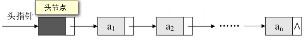

# High！线性表:D

## 一点点的概念
> 线性表(List):零个或多个数据元素的有限序列。

* 元素之间是有顺序的。
* 线性表强调是有限的。

若将线性表记为：$ (a_1,a_2,...,a_{i-1},a_i,a_{i+1},...,a_n) $,则$ a_{i-1} $是$ a_i $的直接前驱元素，$ a_{i+1} $是$ a_i $的直接后继元素。如图：


__线性表元素的个数n(n>=0)定义为线性表的长度，当n=0时，称为空表。____称i为数据元素__$ a_i $ __在线性表中的位序 __ 。


## 线性表的类型定义
```
ADT 线性表（List）
Data
    线性表的数据对象集合为{a1,a2,...,an},每个元素的类型均为DataTyp(一致)。
    其中，除第一个元素a1外，每一个元素有且只有一个直接前驱元素。
    除了最后一个元素an外，每一个元素有且只有一个后置元素。
    数据元素之间的关系是一对一的关系。
Operation
    InitList(*L):初始化操作，建立一个空的线性表L。
    ListEmpty(L):若线性表为空，返回true，否则返回false。
    ClearList(*L):将线性表清空。
    GetElem(L,i,*e):将线性表L中 的第i个位置元素值返回给e。
    LocateElem(L,e):在线性表中查找与给定值e相 等的元素,如果查找成功，返回该元素在表中序号表示成功；否则，返回0表示失败。
    ListInsert(*L,i,e):在线性表L中的第i个位置，插入新元素e。
    ListDelete(*L,i,*e):删除线性表L中第i个位置元素，并用e返回其值。
```

>如果需要修改参数数据，则需要传递指向这个参数的指针；如果不需要修改参数数据，可以直接传递这个参数。

## 线性表的存储顺序

### 1. 顺序存储结构方式

#### 概念：
用一段地址连续的存储单元依次存储线性表的数据元素。

#### 线性表的顺序存储的结构代码：

```c
/* 存储空间初始分配量 */
#define MAXSIZE 20
/* ElemType类型根据实际情况而定，这里假设为int */
typedef int ElemType;
typedef struct SqList
{
    /* 数组存储数据元素，最大值为MAXSIZE */
    ElemType data[MAXSIZE];
    /* 线性表当前长度 */
    int length;
};
```

#### 数组长度与线性表长度区别
* 数组的长度是存放线性表的存储空间的大小，存储分配后这个量是不变的，线性表的长度是线性表中元素个数，随着线性表插入删除操作的进行，这个量是变化的。
* 任意时刻，线性性表的长度应该小于等于数组的长度。

#### 地址计算
>线性表的起始下标是1，于是线性表的第i个元素是要存储在数组下标为i-1的位置。

假设每个顺序元素占c个存储单元，那么线性表中第i+1个数据元素的存储位置和第i个数据元素的存储位置满足以下关系（LOC表示获得存储位置的函数）：

$$ LOC(a_{i+1})=LOC(a_i)+c $$

$$ LOC(a_i)=LOC(a_1)+(i-1)*c  $$

如图(注意理解图中数组与线性表的两者下标对应关系总是相差1；和对LOC公式的理解):


考虑它的时间复杂度，它的存取时间性能为$ O(1) $__。通常把具有这一特点的存储结构称为随机存取结构。__

#### 代码描述之顺序存储结构的插入与删除

##### 获得元素操作
实现GetElem操作，即将线性表L中的第i个位置元素值返回，只要i的数值在数组下标范围内，就是把数组第i-1下标的值返回即可。
```c
#define OK 1
#define ERROR 0
#define TRUE 1
#define FALSE 0
typedef int Status;
/* Status是函数的类型，其值是函数结果状态代码，如OK等 */
/* 初始条件：顺序线性表L已存在，1≤i≤ListLength(L) */
/* 操作结果：用e返回L中第i个数据元素的值 */
Status GetElem(SqList L, int i, ElemType *e)
{
    if(L.length == 0 || i < 1 || i > L.length)
        return ERROR;
    *e = L.data[i-1];
    return OK;
}
```

##### 插入操作
插入算法的思路：

* 如果插入位置不合理，抛出异常；
* 如果线性表长度大于等于数组长度，则抛出异常或动态增加容量；
* 从最后一个元素开始向前遍历到要插入数据的第i个位置，分别都将他们向后移动一个位置。
* 将要插入的元素放到i处，并且修改表长增加1。

实现代码：
```c
/* 初始条件：顺序线性表L已存在，1≤i≤ListLength(L) */
/* 操作结果：在L中第i个位置之前插入新的数据元素e，L的长度加1 */
Status ListInsert(SqList *L, int i, ElemType e)
{
    int k;
    /* 顺序线性表已经满 */
    if(L->length == MAXSIZE)
        return ERROR;
    /* 当i不在范围内时,当i = L->length + 1时代表在末尾插入，这点容易疏漏 */
    if(i < 1 || i > L->length + 1)
        return ERROR;
    if(i <= L->length)
    {
        /*将要插入位置后所有数据元素向后移动一位 */
        for(k = L->length - 1; k >= i-1; k--)
            L->data[k+1] = L->data[k];
    }
    L->data[i-1] = e; /* 将新元素插入 */
    L->length++;     
    return OK;
}
```

##### 删除操作
删除算法的思路：

* 如果删除位置不合理，抛出异常；
* 取出删除元素；
* 从删除元素位置开始遍历到最后一个元素位置，分别将它们都向前移动一个位置。
* 最后，表长减1。

实现代码：
```c
/* 初始条件：顺序线性表L已存在，1≤i≤ListLength(L) */
/* 操作结果：删除L的第i个数据元素，并用e返回其值，L的长度减1 */
Status ListDelete(SqList *L, int i, ElemType *e)
{
    int k;
    /* 线性表为空 */
    if(L->length == 0)
        return ERROR;
    /* 判断删除位置是否合法 */
    if(i > L->length)
        return ERROR;
    /* 如果删除不是最后位置，需将删除位置后继元素前移 */
    if(i < L->length)
    {
        for(k = i; k < L->length; k++)
        L->data[k + 1] = L->data[k];
    }
    L->length--;
    return OK;
}
```


#### 线性表顺序存储结构的优缺点


| 优点 | 缺点 |
|------|------|
|1. 可以快速地存取表中任一位置的元素。<br>2. 无须为表示表中元素之间的逻辑关系而增加额外的存储空间。|1. 插入和删除操作需要移动大量元素。<br>2. 当线性表长度变化较大时，难以确定存储空间的容量。<br>3. 造成存储空间的“碎片”。|

分析它的时间复杂度：

* 如果元素要插入到最后一个位置，或者删除最后一个元素，此时时间复杂度为O(1)，因为不需要移动元素。
* 如果元素要插入到第一个位置或者删除第一个元素，就意味着要移动所有的元素向后或者向前，所以这个时间复杂度为O(n)。
* 至于平均的情况，由于元素插入到第i个位置，或删除第i个元素，需要移动n-i个元素。根据概率原理，每个位置插入或删除元素的可能性是相同的，也就说位置靠前，移动元素多，位置靠后，移动元素少。最终平均移动次数和最中间的那个元素的移动次数相等（这个移动次数是指中间那个元素移动到首部或者尾部），为(n-1)/2。
* __综合推导，平均时间复杂度还是O(n)。__

---

### 2.线性表的链式存储结构
#### 概念
* 存储数据元素信息的域称为数据域，把存储直接后继位置的域称为指针域，有图：


* 指针域中存储的信息叫做指针或链。这两部分组成数据元素ai的存储映像，称为结点(Node)。
* **单链表：** n个结点（$ a_i $的存储映像）链接成一个链表，即为线性表$ (a_1,a_2,...,a_n) $的链式存储结构，因为此链表的每个结点中只包含一个指针域，所以称作单链表。
* 线性链表的最后一个结点指针为“空”（用NULL或'^'表示），有图：


#### 头指针与头节点
**头指针：** 链表中第一个结点的存储位置叫做**头指针**，整个链表的存取是从头指针开始进行。

**头节点：** 为了方便对链表进行操作，会在单链表的第一个节点前附设一个结点，称为头节点。有了头节点，对链表第一个元素的操作就和之后的元素一样了，不必再专门为第一个元素编写函数了，大大方便了很多。头节点的数据域可以不存储任何信息。也可以存储如线性表的长度等附加信息，__头节点的指针域存储指向第一个结点的指针。__

###### 两者的异同：

| 头指针 | 头节点 |
| ------ | ------ |
| 头节点是指链表指向第一个结点<br>的指针,若链表有头结点，则是指<br>向头节点的指针| 头节点是为了操作的统一和方便<br>而设立的,放在第一元素的结点之<br>前,其数据域一般无意义（也可存<br>放链表的长度）|
| 头指针具有标识作用，所以常用<br>头指针冠以链表的名字 | 有了头节点,对在第一元素结点前<br>插入结点和删除第一结点，其操作<br>与其他结点就一致了 |
| 无论链表是否为空，头指针均不<br>为空。头指针是链表的必要元素 | 头结点不一定是链表必须要素 |

#### 空链表
若线性表为空表，则头节点的指针域为空，上图：


### 线性表链式存储结构的存储示意图


PS:若存在头节点，则为：




### 线性表链式存储结构的代码描述

#### 单链表的存储结构描述代码
```c
/* 线性表的单链表存储结构 */
typedef struct Node
{
    ElemType data;
    struct Node *next;
} Node;
/* 定义LinkList */
typedef struct Node  *LinkList;

#define OK 1
#define ERROR 0
#define TRUE 1
#define FALSE 0
typedef int Status;
/* Status是函数的类型，其值是函数结果状态代
码，如OK等 */
```

#### 单链表的读取

获得链表第 i 个数据的算法思路：

1. 声明一个指针p并初始化指向链表第一个结点，初始化计数器$ j $从1开始；
2. 当$ j < i $时,就遍历链表，让p的指向向后移动，不断只想下一个节点。由于单链表的结构中没有定义表长，所以不能事先知道要循环多少次，因此也就不方便使用for来控制循环，这里使用while循环，其主要核心思想就是“工作指针后移”。
3. 若到链表末尾p为空，则说明第i个结点不存在；
4. 否则查找成功，返回结点p的数据。

__单链表的读取的算法实现代码（c代码）：__
```c
/* 初始条件：顺序线性表L已存在，1 ≤ i ≤ ListLength(L) */
/* 操作结果：用e返回L中第i个数据元素的值 */
Status GetElem(LinkList L, int i, ElemType *e)
{
    int j;
    LinkList p;         
    p = L->next;        /*  让p指向链表L的第1个结点 */
    j = 1;
    /* p不为空且计数器j还没有等于i时，循环继续。 */
    /* 如果i不是1，则进入了循环体，j还为1，但执行第一句后p就指向了第2个结点，
       所以p指向的真实结点总是领先j一个单位，所以j < i,而不是j <= i*/
    while (p && j < i)  
    {
        p = p->next; //当j = 1时，
        j++;
    }
    if (!p || j > i)
        return ERROR;
    *e = p->data;
    return OK;
}
```

#### 单链表的插入
假设存储元素e的结点为s，要实现p、p->next和s之间逻辑关系的变化，只需将结点s插入到结点p和p->next之间即可，上图：


如图2演示，改变s->next和p->next的指向，也就是说让p的后继结点改成s的后继结点，再把结点s变成p的后继结点，具体实现代码：
```c
s->next = p->next;
p->next = s;
```

>思考：这两句的顺序可不可以交换？

Absolute not. 如果先p->next=s;再s->next=p->next;会怎么样？哈哈，因为 n此时第一句会使得将p->next给覆盖成s的地址了。那么s->next=p->next，其实就等于s->next=s，这样真正的拥有$ a_{i+1} $数据元素的结点就没了上级。这样的插入操作就是失败的，造成了临场掉链子的尴尬局面。所以这两句是无论如何不能反的。

>是不是还有一个这样的疑问：如何在表头或者表尾进行插入操作？

就是因为之前有头节点的设计，所以不用担心这一点，单链表的表头和表尾的特殊情况，操作是和其他结点相同的。比如插入位置是第一个节点，看图：


__总结下来，单链表第i个数据插入结点的算法思路：__

1. 声明一指针p指向链表头节点，初始化j从1开始。
2. 当$ j < i $时，就遍历 链表，让p的指针向后移动，不断指向下一结点，j累加1。
3. 若到链表末尾p为空，则说明第i个结点不存在；
4. 否则查找成功，在系统中生成一个空结点s；
5. 将数据元素e赋值给s->data；
6. 单链表的插入标准语句(其实就是一针线活：拆穿)s->next=p->next;p->next=s；
7. 返回成功标致。

__单链表第i个数据插入结点的算法实现代码：__
```c
/* 初始条件：顺序线性表L已存在，1 ≤ i ≤ ListLength(L) */
/* 操作结果：在L中第i个位置结点之前插入新的数据元素，L的长度加1 */
Status ListInsert(LinkList *L, int i; ElemType e)
{
    int j;
    LinkList p, s;
    p = *L;
    j = 1;
    /* 寻找第i-1个结点 */
    while (p && j < i)
    {
        p = p->next;
        j++;
    }
    if (!p || j > i)
        return ERROR;
    /* 生成新节点：
       1. 使用malloc开辟一块空间，用于盛放Node类型的结点——转换为LinkList类型。
       2. s接受这个地址，s完成了初始化
       3. 向s->data中填入数据*/
    s = (LinkList)malloc(sizeof(Node));
    s->data = e;

    /*针线活：
        1.将p的后继结点赋值给s的后继
        2.将s赋值给p的后继
     */
    s->next = p->next;
    p->next = s;
    return OK;
}
```

#### 单链表的删除

单链表删除元素的算法原理，如图：


具体的关键步骤：
```c
q = p->next;
p->next = q->next;
```

__单链表第i个数据删除结点的算法思路：__

1. 声明一指针p指向链表头结点，初始化j从1开始；
2. 当j < i时，就遍历链表，让p的指针向后移动，不断指向下一个结点，j累加1；
3. 若到链表末尾p为空，则说明第i个结点不存在；
4. 否则查找成功，——p为要删除节点的上一个节点，将欲删除的结点p->next赋值给q；
5. 单链表的删除标准语句（记住这是一个针线活）p->next = q->next；
6. 将q结点中的数据赋值给e，作为返回；
7. 释放q结点；
8. 返回成功标致。

__单链表删除第i个元素的算法实现代码：__
```c
/* 初始条件：顺序线性表L已存在，1 ≤ i ≤ ListLength(L) */
/* 操作结果：删除L上的第i个结点，并用e返回其值，L的长度减1 */
Status ListDelete(LinkList *L, int i)
{
    int j;
    LinkList p, q;
    j = 1;
    /* 遍历寻找第i-1个结点 */
    while(p && j < i)
    {
        p = p->next;
        j++;
    }
    if(!p || j > i)
        return ERROR;

    /* 针线活：
         1.将q的后继赋值给p的后继，让p实现了跳跃
         2.将q结点中的数据给e */
    q = p->next;
    p->next = q->next;

    *e = q->data;
    /* 使用内存释放函数，让系统回收此结点，释放内存 */
    free(q);
    return OK;
}
```

---

>分析单链表插入和删除算法，发现，它们其实都是由两部分组成：第一部分就是遍历查找第i个结点；第二部分就是插入和删除结点。

---

#### 单链表的整表创建
单链表是一种动态结构，它所占用的空间大小和位置是不需要预先分配划定的，可以根据系统的情况和实际的需求即时生成。所以创建单链表的过程就是一个动态生成链表的过程。即从“空表”的初始状态起，依次建立各元素结点，并逐个插入到链表。

单链表整表创建的两种方法分别是：__头插法，尾插法__。

<br>
######  头插法
>想象新节点的插入其实就是一个插队的过程，就是始终让新节点在第一的位置。

__采用头插法单链表整表创建的算法思路__：

1. 声明一指针p和计数器变量i；
2. 初始化一个空链表L；
3. 让L的头节点的指针指向NULL，即建立一个带头节点的单链表。
4. 循环：<br> &nbsp;&nbsp;(1) 生成一新节点赋值给p； <br> &nbsp;&nbsp;(2) 随机生成一数字赋值给p的数据域p->data；<br> &nbsp;&nbsp;(3) 将p插入到头结点与前一新结点之间。

__创建单链表之头插法算法的实现代码：__
```c
/* 随机产生n个元素的值，建立带表头结点的单链线性表L (头插法) */
void CreateListHead(LinkList *L, int n)
{
    LinkList p;
    int i;
    srand(time(0));     /* 以当前系统时间数初始化随机数种子 */
    *L = (LinkList)malloc(sizeof(Node));
    (*L)->next = NULL;      /* 先建立了一个带头节点的单链表 */
    for(i = 0; i < n; i++)
    {
        p = (LinkList)malloc(sizeof(Node)); /* 生成新节点 */
        p->data = rand() % 100 + 1; /* 随机生成100以内的数字 */
        p->next = (*L)->next;
        (*L)->next = p; /* 插入到表头 */
    }
}
```

为了方便理解上述代码的逻辑，如图表述:


懂了吗？少年！


<br>
###### 尾插法
>继续想象，新节点的插入和标准站队的顺序一样，讲究个先来后到——后来的站在之前的后面。

__采用尾插法单链表整表创建的算法思路__：

1. 声明一指针p和计数器变量i；
2. 初始化一个空链表L；
3. 新建一个结点r，使其成为尾节点；
4. 循环：<br> &nbsp;&nbsp; (1) 生成一新节点赋值给p；<br> &nbsp;&nbsp; (2) 随机生成一数字赋值给p的数据域p->data；<br> &nbsp;&nbsp; (3) 改变尾节点的指针指向新节点；<br> &nbsp;&nbsp; (4) 重新定义尾结点：将新节点定义为尾结点。
5. 定义尾结点的指针为空(r->next = null)，结束链表。

__创建单链表之尾插法算法的实现代码：__
```c
/* 随机产生n个元素的值，建立带表头结点的单链线性表L (尾插法) */
void CreateListTail(LinkList *L, int n)
{
    LinkList p,r;
    int i;
    srand(time(0)); /* 以当前系统时间数初始化随机数种子 */
    *L = (LinkList)malloc(sizeof(Node));
    r = *L; /* r为指向尾部的结点 */
    for(i = 0; i < n; i++)
    {
        p = (LinkList)malloc(sizeof(Node));
        p->data = rand() % 100 + 1; /* 随机生成100以内的数字 */
        r->next = p; /* 将表尾端结点的指针指向新节点 */
        r = p;/* 将当前的新节点定义为表尾终端节点 */
    }
    r->next = NULL; /* 表示当前链表结束 */
}
```

注意程序里L与r的关系，L是指整个单链表，而r是指向尾结点的变量，r会随着循环不断地变化节点，也就是说尾结点随着新节点的进入而随之相应的改变，而L则是随着循环增长为一个多结点的链表。

__解释r->next = p的意思：__表尾终端结点r的指针指向新结点p，如图所示，当中①位置的箭头表示这个意思。


__解释r = p的意思：__链表连接上新节点后，原来的尾结点就变为成了$ a_{i-1} $元素，它已经不是最后的结点了，现在最后的结点是$ a_i $,也就是刚刚连接上的新节点，所以应该把这个新节点定义为新的尾结点，即将p结点这个最后的结点赋值给r。那么，此时r又是最终的尾结点了。如图：


循环结束后，那么应该让这个节点的指针域置空，使其成为尾结点，因此有了“r->next=NULL;”，以便以后遍历时可以确认其是尾部。


#### 单链表的整表删除

>当程序员不打算使用这个单链表时，程序员需要把它销毁，其实也就是在内存中将它释放掉，以便于留出空间给其他程序或软件使用。

__单链表整表删除的算法思路：__

1. 声明两指针p和q；
2. 将第一结点赋值给p；
3. 循环：<br>&nbsp;&nbsp; (1) 将下一节点赋值给q；<br>&nbsp;&nbsp; (2) 释放p； <br>&nbsp;&nbsp; (3) 将q赋值给p；

__单链表整表删除算法的实现代码：__
```c
/* 初始条件：链式线性表L已存在 */
/* 操作结果：将L重置为空表 */
Status ClearList(LinkList *L)
{
    LinkList p,q;
    p = (*L)->next; /* p指向第一个节点 */
    while(p)   /* 只要p不为空，就没到表尾，因为尾结点的指针域为空 */
    {
        q = p->next;
        free(p);
        p = q;
    }
    (*L)->next = NULL; /* 头节点指针域为空 */
    return OK;
}
```

>这段算法代码里，常见的错误就是有同学会觉得q变量没有存在的必要。在循环体内直接写free(p);p = p->next;即可。可这样会带来什么问题？<br><br>
要知道p指向一个结点，它除了有数据域，还有指针域。你在做free(p);时，其实是在对它整个结点进行删除和内存释放的工作。这就好比皇帝快要病死了，却还没有册封太子，他儿子五六个，你说要是你脚一蹬倒是解脱了，这国家咋办，你那几个儿子咋办？这要是为了皇位，什么亲兄弟血肉情都成了浮云，一定会打起来。所以不行，皇帝不能马上死，得先把遗嘱写好，说清楚，哪个儿子做太子才行。而这个遗嘱就是变量q的作用，它使得下一个结点是谁得到了记录，以便于等当前结点释放后，把下一结点拿回来补充。明白了吗？


<br>
## 总结：单链表结构与顺序存储结构优缺点


通过对比，可以得出一些经验性结论：

* __若线性表很少进行插入和删除操作时，宜采用顺序存储结构。若需要频繁插
入和删除时，宜采用单链表结构。__ 比如说游戏开发中，对于用户注册的个人信息，除了注册时插入数据外，绝大多数情况都是读取，所以应该考虑用顺序存储结构。而游戏中的玩家的武器或者装备列表，随着玩家的游戏过程中，可能会随时增加或删除，此时再用顺序存储就不太合适了，单链表结构就可以大展拳脚。当然，这只是简单的类比，现实中的软件开发，要考虑的问题会复杂得多。
* __当线性表中的元素个数变化较大或者根本不知道有多大时，最好使用单链表结构，这样不需要考虑存储空间的大小问题。__而如果事先知道线性表的大致长度，比如一年12个月，一周就是星期一至星期日共七天，这种用顺序存储结构效率会高很多。

总之，线性表的顺序存储结构和单链表结构各有其优缺点，不能简单的说哪个好，哪个不好，需要根据实际情况，来综合平衡采用哪种数据结构更能满足和达到需求和性能。


<br>
## 静态链表

>一些高级语言没有指针机制，就比如上一年学过的java，虽然现在也几乎忘干净了，但还记得它没有指针机制，被数据结构爆虐的这两周，越发思念学习java的日子，打住，继续学习！

### 认识静态链表

用结构数组来描述单链表，数组的下标起到指针的作用。那么，__这种用数组描述的链表叫做静态链表，这种描述方法还有起名叫做游标实现法。__

### 静态链表存储结构描述代码
```c
/* 线性链表静态链表的存储结构 */
#define MAXSIZE 1000 /* 假设静态链表的最大长度是1000 */
typedef struct
{
    ElemType data;
    int cur; /* 游标(Cursor),为0时表示无指向 */
} Component, StaticLinkList[MAXSIZE];
```

>对于静态链表，结构数组的第一个元素和最后一个元素比较特殊，它们有着相应的功能，才能支持着使用结构数组去实现单链表的思想。在这里，需要注意以下几个概念：

__备用链表：__通常把未被使用的数组元素称为备用链表。

__数组第一个元素：__数组第一个元素，即下标为0的元素的cur就存放备用链表的第一个结点的下标。它记录着哪里是可以使用的空闲空间的第一个元素，有了它，就可以直接找到备用链表的第一个分量，如果被用链表已经使用完毕，那么它的cur值就是0喽。

__数组最后一个元素：__最后一个元素的cur存放第一个有数值的元素的下标。有了它，就可以知道整个静态链表存在于数组哪里是开始的位置。而且仅当整个数组其余元素（除了第一个元素）都已经被使用了，那么最后一个元素的“标识功能”已经完成了使命，下一步，根据算法的流程，它就会被用于存储新的结点。

上述概念，如图所示：


### 静态链表的初始化

```c
/* 初始化一个空的静态链表，注意：将一维数组space中各分量链成一个备用链表，
   并不是让每一个元素的cur为0 */
/* space[0].cur为头指针，“0” 表示空指针 */
Status InitList(StaticLinkList space)
{
    int i;
    for (i = 0; i <= MAXSIZE; i++)
        space[i].cur = i + 1;
    space[MAXSIZE - 1].cur = 0; /* 目前静态链表为空，最后一个元素的的cur为0 */
    return OK;
}
```

为了容易理解程序代码，使用一个容量只有4的数组去模拟这个过程，如图所示：


### 静态链表的插入操作

对于静态链表存在一个很尴尬的问题：如何用静态模拟动态链表结构的存储空间的分配，也就是需要时申请，无用时释放。

之前的学习静态链表，使用的语言是c，当然要使用malloc(),和free()函数去动态申请内存空间和释放内存空间。静态的链表的产生就是要在没有指针机制的语言平台上实现动态链表的结构，当然就没有再使用这两个函数的说法啦。那么问题来了？要实现静态链表的插入与删除，就需要自己实现相关的函数啦。

#### 插入操作的算法思路：

* __第一步，获取存储新结点“空间”__


将所有未被使用以及已被删除的分量用游标链成一个备用的链表，每当进行插入时，从备用链表上取得第一个节点作为待插入的结点。 下面的Malloc_SSL()的函数的作用就是返回一个下标值，这个值就是数组头元素的cur存的第一个空闲的下标。

```c
/* 若备用空间链表非空，则分配返回的结点下标，否则返回0 */
int Malloc_SSL(StaticLinkList space)
{
    int i = space[0].cur; /* 当前数组第一个元素的cur值，就是备用链表的第一个分量 */
    if(space[0].cur)
        space[0].cur = space[i].cur;/* 使用了备用链表的一个分量，所以把下一个备用链
                                       表的分量的下标存为数组第一个元素的cur值，也就
                                       是为下一次的获取备用链表分量做好准备 */
    return i; /* 返回备用链表的第一个分量 */
}
```

* __第二步，把新元素插入：__

虽然静态链表采用的是数组结构，但千万不要想当然的认为它要和顺序存储结构一样，每次插入操作都需要把插入位置点之后的所有元素后置移动，还是那么的低效。不不不，静态链表的精妙之处就在于每个结点里面存储的cur值，它真的就可以像指针一样指导着结点的方向。每次插入的时候，不必在意新节点具体存放的物理位置（数组中的那个房间），只需要修改相应元素的cur值就可以了。

通俗的理解就是：首先，插入的新节点的cur值要改，因为新的结点要知道后面的同志是谁；然后，插入点位序之前的结点cur值要改，因为现在后面的同志变成了新的同志，它要知道新同志的位置。

这次演示用一个长一点的静态链表，具体逻辑，看演示：

_假设已经有数据存入了静态链表，比如分别存放着“乙”、“丁”、“戊”、“己”、“庚”等数据，那么它的状态如图所示：_


_现在需要在“乙”和“丁”之间，插入一个值为“丙”的元素_


把上述这个操作封装为一个函数ListInsert()，具体实现代码：

```c
/* 在 L 中第 i 个元素之前插入新的数据元素 e */  
Status ListInsert(StaticLinkList L, int i, ElemType e)
{  
    int j, k, l;  

    k = MAXSIZE - 1; /* 注意 k 首先是最后一个元素的下标 */  
    if (i < 1 || i > ListLength(L) + 1)  /* 判断插入位置是否正确 */
        return ERROR;  
    j = Malloc_SSL(L);  /* 获得空闲分量的下标 */
    if (j) {    
        L[j].data = e; /* 将数据赋值给此分量的 data */  
        for (l = 1; l <= i - 1; l++) /* 找到第 i 个元素之前的位置 */  
            k = L[k].cur;  
        L[j].cur = L[k].cur;  /* 把第 i 个元素之前的 cur 赋值给新元素的 cur */  
        L[k].cur = j;  /* 把新元素的下标赋值给第 i 个元素之前元素的 ur */  
        return OK;  
    }  
    return ERROR;  
}  
```

这里补充一下以上程序和以下程序经常使用的静态链表的ListLength()函数：
```c
/* 初始条件：静态链表L已存在 */
/* 操作结果：返回L中数据元素的个数 */
int ListLength(StaticLinkList L)
{
    int j = 0;
    int i = L[MAXSIZE - 1].cur;
    while(i)
    {
        i = L[i].cur;
        j++;
    }
    return j;
}

```

### 静态链表的删除操作

对于静态链表的删除操作，本质就是把要删除的分量归为备用链表，那么就等于把它删除了。当然还要做好cur值修改的工作（无非就是把删除分量的cur值覆盖删除点之前分量的cur值，具体理解可以看单链表删除操作的配图）。当要删除静态链表中某一个结点的时候，使用如下的ListDelete()和Free_SSL()两个函数：

```c
/* 删除再L中第 i 个元素 */
Status ListDelete(StaticLinkList L, int i)
{
    int j, k;
    if(i < 1 || i > ListLength(L))
        return ERROR;
    k = MAXSIZE -1;
    for(j = 1; j <= i - 1; j++)
        k = L[k].cur;  /* 循环结束得到的k值是删除点之前元素的下标值 */
    j = L[k].cur;
    L[k].cur = L[j].cur;
    Free_SSL(L,j);   /* 模仿free()函数的功能 */
    return OK;
}

/* 将下标为k的空闲结点回收到备用链表 */
void Free_SSL(StaticLinkList space, int k)
{
    space[k].cur = space[0].cur; /* 把数组的第一个元素的cur值赋值给要删除分量的cur */
    space[0].cur = k; /* 把要删除的分量的下标赋值给数组第一个元素的cur */
}
```

其中的Free_SSL函数内部虽然只有两行代码，但真的很巧妙，因为它把删除的位置的下标存入了第一个元素的cur中，所以要删除的位置就成为了第一个优先空位，而且它的下标变为了之前的第一个优先空位的下标（如果存在的话），这样的话，备用链表就始终保持着链结的状态。

那么，经过删除操作过后(假如删除元素甲)，之前演示用过的链表就变成了这种状态，如图：


### 总结静态链表的优缺点


总的来说，静态链表其实是为了给没有指针的高级语言设计的一种实现单链表能力的方法。这样的思考方式很可贵，重在理解它的思想。

<br>
## 循环链表

### 概念

单链表中终端节点的指针端由空指针改为指向头节点，就使整个单链表形成一个环，这种头尾相接的单链表称为单循环链表，简称循环链(circular linked list).

如果设有头结点，那么带有头结点的空链表的结构示意图，如下：


*循环单链表为空时，只有头节点，头节点的指针域存自身的位置（头节点点首地址位置），就形成了如图所示的结构*
